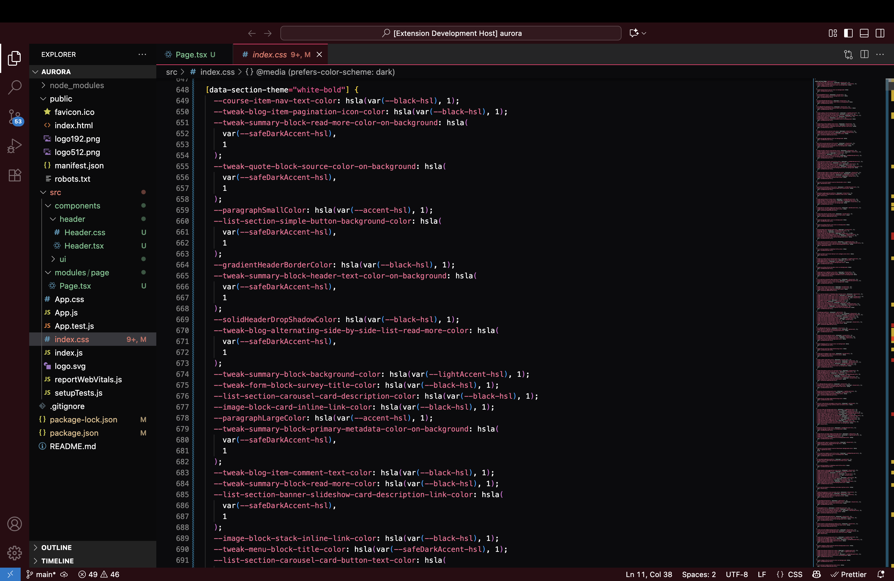
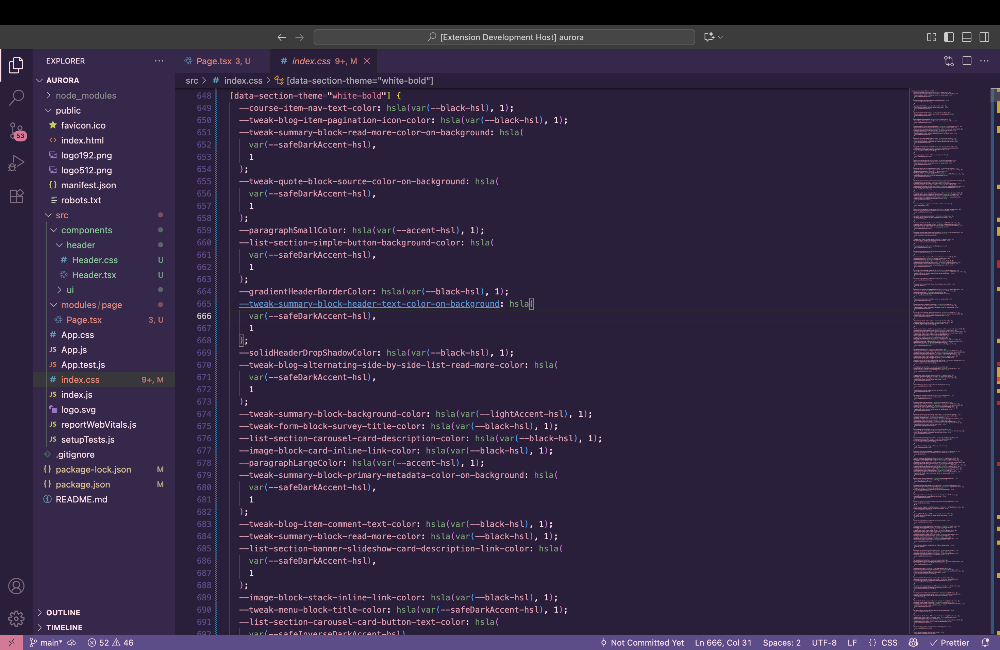
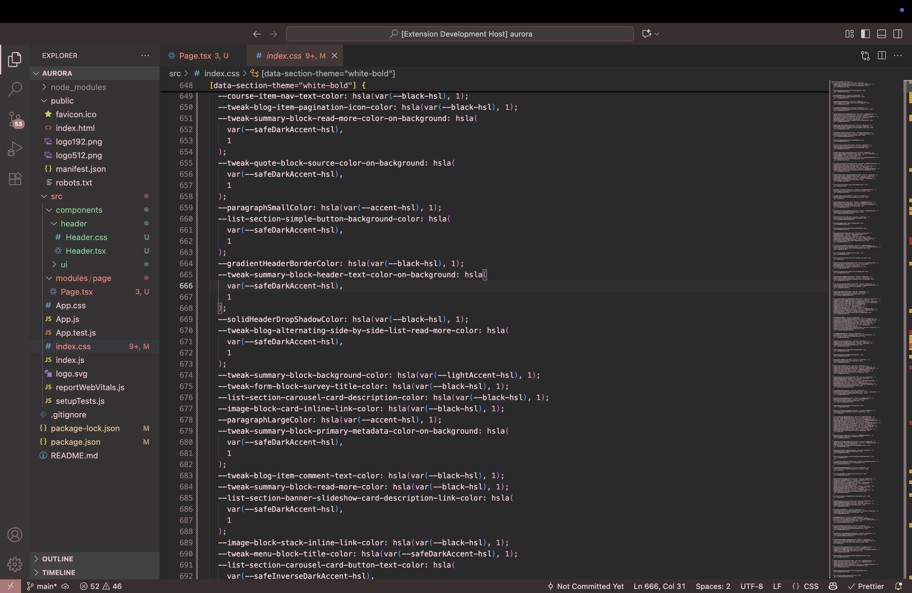
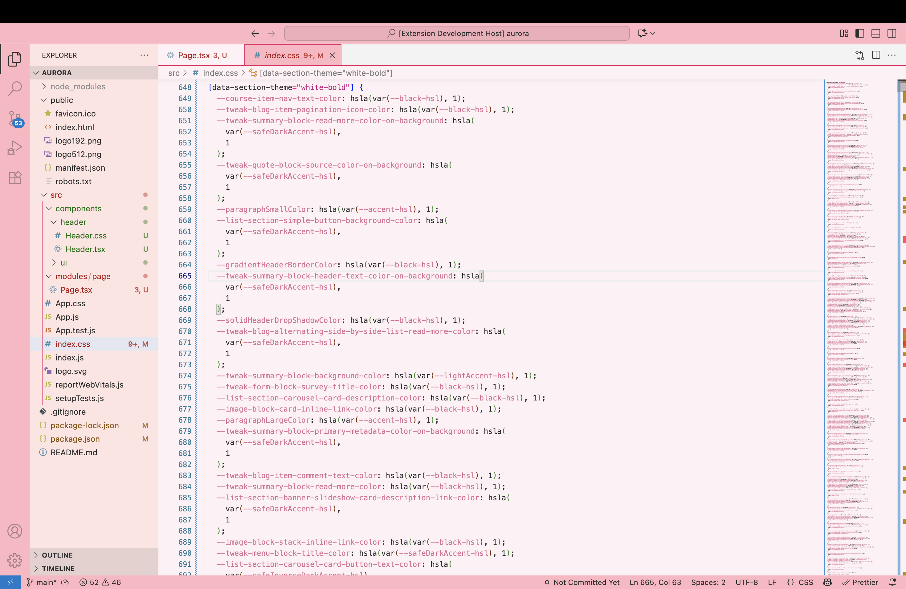

# All Pink Themes are here!

This is my extension to change boring theme to excited colors. We all love pink.

# Pink a theme

And many more!!!

# Contribute theme

If you have any idea, here is my source code:  

## Running the Sample

- Run `npm install` in terminal to install dependencies
- Run the `Run Extension` target in the Debug View. This will:
  - Start a task `npm: watch` to compile the code
  - Run the extension in a new VS Code window
